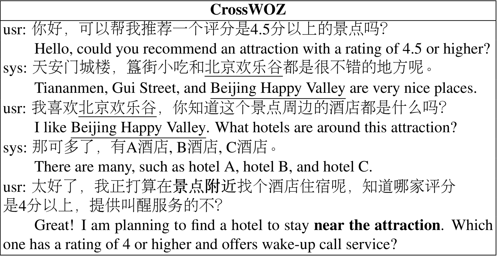
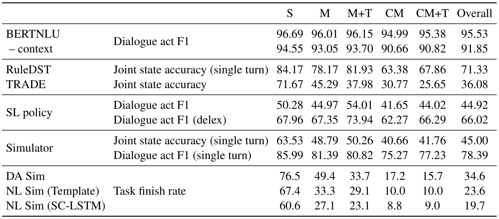

# CrossWOZ

CrossWOZ is the first large-scale Chinese Cross-Domain Wizard-of-Oz task-oriented dataset. It contains **6K** dialogue sessions and **102K** utterances for 5 domains, including hotel, restaurant, attraction, metro, and taxi. Moreover, the corpus contains rich annotation of dialogue states and dialogue acts at both user and system sides. We also provide a user simulator and several benchmark models for pipelined taskoriented dialogue systems, which will facilitate researchers to compare and evaluate their models on this corpus.

Refer to our paper for more details:  [CrossWOZ: A Large-Scale Chinese Cross-Domain Task-Oriented Dialogue Dataset](https://arxiv.org/abs/2002.11893) (accepted by TACL)

If you have any question, feel free to open an issue.

## Data

A piece of dialogue: (Names of hotels are replaced by A,B,C for simplicity.)



In `data/crosswoz` directory. Data statistics:

| Split                 | Train  | Valid | Test  |
| --------------------- | ------ | ----- | ----- |
| \# dialogues          | 5,012  | 500   | 500   |
| \# Turns (utterances) | 84,692 | 8,458 | 8,476 |
| Vocab                 | 12,502 | 5,202 | 5,143 |
| Avg. sub-goals        | 3.24   | 3.26  | 3.26  |
| Avg. semantic tuples  | 14.8   | 14.9  | 15.0  |
| Avg. turns            | 16.9   | 16.9  | 17.0  |
| Avg. tokens per turn  | 16.3   | 16.3  | 16.2  |

According to the type of user goal, we group the dialogues in the **training set** into five categories:

- **S**: 417 dialogues have only one sub-goal in HAR domains.
- **M**: 1573 dialogues have multiple sub-goals (2-3) in HAR domains. However, these sub-goals do not have cross-domain informable slots.
- **M+T**: 691 dialogues have multiple sub-goals in HAR domains and at least one sub-goal in the metro or taxi domain (3-5 sub-goals). The sub-goals in HAR domains do not have cross-domain informable slots.
- **CM**: 1,759 dialogues have multiple sub-goals (2-5) in HAR domains with cross-domain informable slots.
- **CM+T**: 572 dialogues have multiple sub-goals in HAR domains with cross-domain informable slots and at least one sub-goal in the metro or taxi domain (3-5 sub-goals).

Statistics for dialogues of different goal types in the training set:

| Goal type            | S    | M    | M+T  | CM   | CM+T |
| -------------------- | ---- | ---- | ---- | ---- | ---- |
| \# dialogues         | 417  | 1573 | 691  | 1759 | 572  |
| NoOffer rate         | 0.10 | 0.22 | 0.22 | 0.61 | 0.55 |
| Multi-query rate     | 0.06 | 0.07 | 0.07 | 0.14 | 0.12 |
| Goal change rate     | 0.10 | 0.28 | 0.31 | 0.69 | 0.63 |
| Avg. dialogue acts   | 1.85 | 1.90 | 2.09 | 2.06 | 2.11 |
| Avg. sub-goals       | 1.00 | 2.49 | 3.62 | 3.87 | 4.57 |
| Avg. semantic tuples | 4.5  | 11.3 | 15.8 | 18.2 | 20.7 |
| Avg. turns           | 6.8  | 13.7 | 16.0 | 21.0 | 21.6 |
| Avg. tokens per turn | 13.2 | 15.2 | 16.3 | 16.9 | 17.0 |

We also provide database in `data/crosswoz/database`.

## Code

please install via:

```
pip install -e .
```

Code:

- BERTNLU: `convlab2/nlu/jointBERT/crosswoz`
  - Trained model: https://convlab.blob.core.windows.net/convlab-2/bert_crosswoz_all_context.zip
- RuleDST: `convlab2/dst/rule/crosswoz`
- TRADE: `convlab2/dst/trade/crosswoz`
  - Trained model: https://convlab.blob.core.windows.net/convlab-2/trade_crosswoz_model.zip
  - Preprocessed data: https://convlab.blob.core.windows.net/convlab-2/trade_crosswoz_data.zip
- SL policy: `convlab2/policy/mle/crosswoz`
  - Trained model: https://convlab.blob.core.windows.net/convlab-2/mle_policy_crosswoz.zip
- SCLSTM: `convlab2/nlg/sclstm/crosswoz`
  - Trained model: https://convlab.blob.core.windows.net/convlab-2/nlg_sclstm_crosswoz.zip
- TemplateNLG: `convlab2/nlg/template/crosswoz`
- User simulator: `convlab2/policy/rule/crosswoz`
- Evaluate with user simulator: `convlab2/policy/mle/crosswoz/evaluate.py`

Result:



## Citing

Please kindly cite our paper if this paper and the dataset are helpful.
```
@article{zhu2020crosswoz,
  author = {Qi Zhu and Kaili Huang and Zheng Zhang and Xiaoyan Zhu and Minlie Huang},
  title = {Cross{WOZ}: A Large-Scale Chinese Cross-Domain Task-Oriented Dialogue Dataset},
  journal = {Transactions of the Association for Computational Linguistics},
  year = {2020}
}
```
